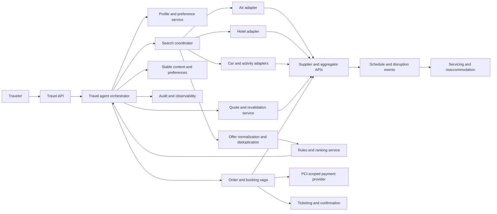
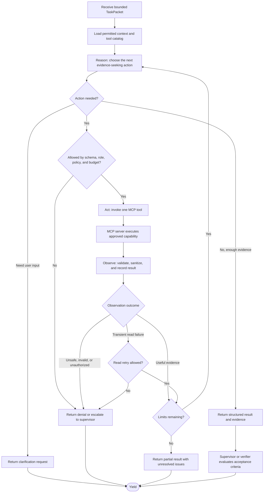
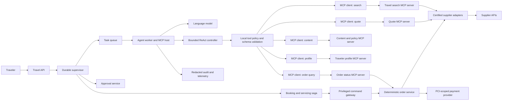
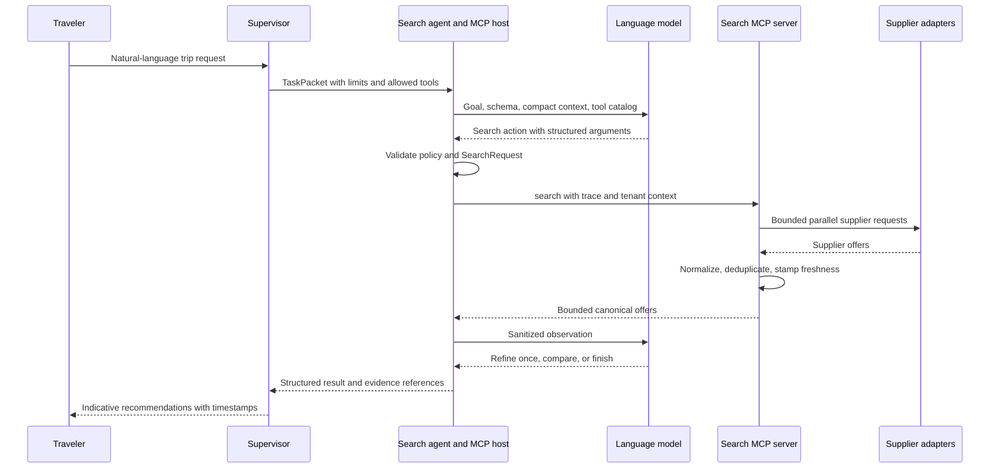
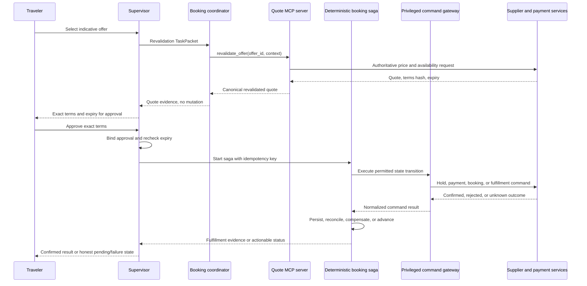
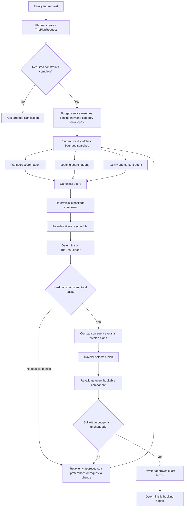
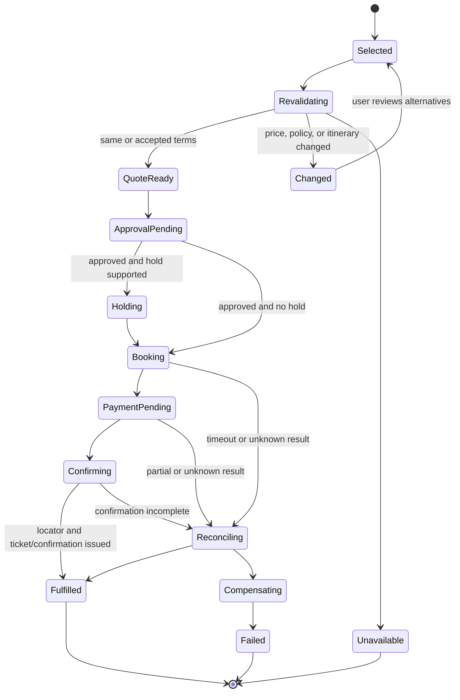

# Travel Multi-Agent System Design

## Document status

| Field | Value |
|---|---|
| Status | Proposed |
| Audience | Travel product engineers, platform engineers, supplier-integration teams, security reviewers, and operators |
| Foundation | [`DESIGN.md`](DESIGN.md) |
| Initial implementation | Python 3.12, LangGraph, FastAPI, PostgreSQL, Redis, and object storage |
| Deployment targets | Local Docker Compose for development; Microsoft Azure or Amazon Web Services for production |

## 1. Purpose

This document specializes the provider-neutral autonomous-agent architecture in [`DESIGN.md`](DESIGN.md) for travel search, booking, fulfillment, and servicing. The base document remains authoritative for orchestration, multi-agent task packets, tool policy, durable memory, cloud deployment, observability, and general security.

Travel search and booking is not ordinary document retrieval. Inventory, price, schedules, fare rules, room policies, and ancillary availability are observations valid for a particular request at a particular time. The language model may interpret intent and explain options, but deterministic services own search normalization, pricing arithmetic, offer validity, booking transitions, payment boundaries, and supplier reconciliation.

## 2. Scope

### 2.1 Goals

- Convert natural-language trip intent into validated travel search requests.
- Search multiple suppliers while respecting their quotas, contracts, and display rules.
- Normalize and compare air, hotel, car, activity, and package offers.
- Revalidate availability, price, schedule, taxes, fees, and policies before commitment.
- Complete hold, booking, payment, confirmation, ticketing, cancellation, exchange, and refund workflows safely.
- Process schedule changes and disruptions without inventing operational status.
- Protect payment data and sensitive traveler information from models and general-purpose memory.
- Preserve an auditable record of displayed terms, approval, supplier calls, and fulfillment.

### 2.2 Non-goals

- Using semantic memory as a live inventory or pricing source.
- Allowing a model to calculate authoritative totals or choose an unapproved replacement itinerary.
- Blindly retrying a timed-out booking, payment, cancellation, exchange, or refund.
- Sending raw payment credentials, passport data, or full traveler profiles to a model.
- Replacing supplier systems of record, global distribution systems, or certified order platforms.

## 3. Relationship to the base design

All base requirements remain in force. This design adds the following travel invariants:

1. Every offer has a source, observation time, expiration, request context, and freshness state.
2. Search results are indicative until an authoritative supplier revalidation succeeds.
3. User approval binds exact itinerary, travelers, price, currency, policies, included services, and quote expiry.
4. Changed price, schedule, inventory, or policy invalidates approval.
5. A mutating timeout creates an unknown outcome that must be reconciled before retry.
6. Booking is not complete until required fulfillment evidence exists.
7. Live inventory and prices never become durable semantic memory.
8. Models never control payment execution, money arithmetic, idempotency, or order-state transitions.

## 4. Domain architecture



Add deterministic services or modules for:

- supplier connectivity, authentication, throttling, circuit breaking, and schema translation;
- canonical offer normalization, deduplication, and itinerary identity;
- currency, tax, fee, commission, and rounding calculations;
- live quote and availability revalidation;
- booking, payment, fulfillment, cancellation, exchange, and refund sagas;
- policy and fare-rule evaluation;
- schedule-change and disruption event processing; and
- traveler identity, consent, loyalty, and preference management.

Use industry standards where partners support them, such as IATA NDC and ONE Order for air and OTA schemas for hospitality, but isolate every supplier behind an anti-corruption adapter. A supplier payload must not become the internal domain model.

## 5. Agent roles

Use the base planner, supervisor, verifier, and memory-manager roles with travel-specific workers:

| Role | Responsibility | Prohibited authority |
|---|---|---|
| Trip planner | Decompose intent, identify missing constraints, and propose search strategies | Cannot invent or reserve inventory |
| Search agent | Coordinate bounded supplier searches and request additional candidates | Cannot treat cached offers as current |
| Comparison agent | Explain normalized results and tradeoffs | Cannot calculate authoritative totals |
| Policy agent | Summarize cited fare, room, baggage, change, and cancellation terms | Cannot override original policy text or deterministic rules |
| Booking coordinator | Collect required fields and advance the deterministic booking saga | Cannot bypass approval or alter bound terms |
| Disruption agent | Explain supplier events and propose valid servicing options | Cannot silently accept itinerary changes |
| Verifier | Check freshness, approval binding, supplier outcome, and fulfillment evidence | Cannot approve its own mutations |

These are logical roles, not necessarily separate processes or models. Start with one worker service and role-specific prompts. Split workers only for permission isolation, independent scaling, or demonstrated quality improvements.

### 5.1 Where ReAct applies

ReAct is an execution pattern inside selected agent workers, not the top-level system architecture. A bounded worker alternates between choosing an action, invoking an allowed tool, observing its result, and deciding whether it has enough evidence to return a structured task result.

Use ReAct for tasks where the next useful read-only action depends on the previous observation:

- resolving ambiguous destinations, dates, airports, stations, or properties;
- refining search constraints after a supplier returns no exact match;
- gathering stable destination content and cited policy material;
- comparing a bounded set of normalized offers;
- investigating a disruption and retrieving eligible alternatives; and
- collecting evidence for the verifier.

Do not use an open-ended ReAct loop to control booking, payment, ticketing, cancellation, exchange, or refund state. Those operations use deterministic sagas. A model may propose the next command, but application code validates state, approval, quote freshness, terms hash, authorization, and idempotency before executing it.

The worker loop is bounded by its `TaskPacket`:

```text
task context
  -> decide next allowed action
  -> call one MCP tool
  -> validate and sanitize observation
  -> update compact working state
  -> repeat, return, or escalate
```



For travel, the loop is appropriate for search, comparison, policy retrieval, and disruption investigation. It yields before any privileged mutation: quote approval, booking, payment, ticketing, cancellation, exchange, and refund continue through deterministic workflow state machines.

Enforce maximum steps, wall time, tokens, cost, repeated-call detection, and per-tool quotas outside the prompt. Keep private model reasoning ephemeral. Persist the selected action, normalized arguments, observation reference, evidence, and concise decision summary, but do not require or expose chain-of-thought.

### 5.2 Where MCP applies

Model Context Protocol (MCP) is the interoperability boundary between an agent worker and approved capabilities. It standardizes discovery and invocation of tools and access to resources; it does not provide business authorization, workflow durability, transaction semantics, supplier certification, or safe execution by itself.

In MCP terminology:

- the **MCP host** is the travel-agent worker runtime that owns model interaction, task context, policy, and MCP clients;
- an **MCP client** maintains an isolated connection from the host to one MCP server;
- an **MCP server** exposes a narrow domain capability through tools and resources; and
- the **travel control plane** remains outside MCP and owns identity, approvals, budgets, checkpoints, and saga transitions.

Use MCP primitives as follows:

| MCP primitive | Travel use | Constraint |
|---|---|---|
| Tools | Search, retrieve details, quote, lookup order, and request deterministic commands | Local policy decides whether a discovered tool is usable |
| Resources | Stable destination content, supplier capability metadata, policy snapshots, schemas, and artifact references | Live availability is never inferred from a resource or cached resource |
| Prompts | Optional versioned templates for search clarification or disruption explanation | Server prompts cannot override host policy or approval rules |
| Sampling | Normally disabled for domain servers | If enabled, the host applies model, data, cost, and consent policy |

Tool descriptions and annotations received from an MCP server are untrusted metadata. The host maintains a reviewed registry containing server identity, tool version, local input/output schema, risk class, allowed roles, timeout, egress policy, and approval requirement.

### 5.3 ReAct and MCP component architecture



The privileged command gateway is intentionally not available to general search, comparison, content, or profile ReAct loops. After exact-terms approval, the supervisor advances the deterministic saga, which invokes the gateway with a service identity and idempotency key. MCP may be used behind this gateway as an implementation protocol, but the model does not receive a direct unrestricted booking tool.

### 5.4 Recommended MCP server boundaries

| Server | Example capabilities | Risk and freshness |
|---|---|---|
| Travel search | `search_air`, `search_lodging`, `search_cars`, `get_offer_details` | Read-only; results are indicative and expire |
| Quote | `revalidate_offer`, `get_quote` | Read-only externally but creates a short-lived quote; authoritative supplier call required |
| Content and policy | Destination content, amenity definitions, cited supplier policy text | Read-only; every resource carries provenance and observation time |
| Traveler profile | Read consented preferences and loyalty hints; propose profile updates | Field-level authorization; sensitive identity fields withheld from models |
| Order query | `get_order`, `get_fulfillment`, `get_refund_status` | Read-only projection plus authoritative reconciliation when required |
| Operations | Supplier health, capability, quota, and certification metadata | Restricted to supervisor and operations roles |
| Privileged commands | Hold, book, cancel, exchange, refund, send notification | Not exposed to general ReAct; called only by an approved deterministic saga |

Do not create one MCP server per agent. Define servers around security, ownership, data, scaling, and failure boundaries. Multiple agent roles can use the same server through different local allowlists, while one role can connect to several servers.

Supplier-specific schemas remain behind certified adapters. MCP tools expose canonical travel contracts, not raw NDC, OTA, global distribution system, or supplier payloads. This prevents prompts and agents from accumulating supplier-specific transaction logic.

### 5.5 Search and recommendation flow



The model never sees the full supplier inventory. The search MCP server enforces fan-out, supplier quotas, normalization, offer limits, and output size. The ReAct controller may refine a search only within the task budget and must not relax hard traveler constraints without confirmation.

### 5.6 Quote and booking flow



ReAct ends before approval and mutation. If revalidation changes any bound term, the flow returns to traveler review. If a command times out, the saga enters `UNKNOWN` and performs an order lookup; neither the model nor MCP transport retry policy may repeat the mutation blindly.

### 5.7 MCP transport and deployment

For local development, run trusted MCP servers as separate containers or child processes. Use standard input/output transport for tightly coupled local developer tools and Streamable HTTP for containerized services that need independent scaling. Bind local HTTP servers to the private Compose network rather than the host interface unless direct access is required.

For Azure or AWS, deploy remote MCP servers as private services behind internal ingress or load balancers. Give each server its own managed identity or task role, network policy, autoscaling rule, and secret scope. Authenticate host-to-server calls, propagate tenant and trace context, and authorize again inside the server. Never forward a user's bearer token to a supplier.

Search MCP servers scale on concurrent requests and supplier quotas. Quote and order-query servers keep minimum warm capacity. Privileged command workers scale conservatively and serialize order mutations. Apply connection timeouts, bounded retries for read-only calls, circuit breakers, output-size limits, and protocol-version compatibility tests.

### 5.8 MCP security and governance

- Pin and review server implementations and tool schemas; do not auto-enable newly discovered tools in production.
- Maintain separate read-only and privileged server identities and network paths.
- Pass opaque references instead of payment data, passport details, or complete traveler records.
- Validate tool results against canonical schemas and treat all returned text as untrusted content.
- Redact MCP arguments and results before logs, traces, model context, and durable memory.
- Bind each call to tenant, task, role, run, trace, deadline, and idempotency context.
- Deny server-initiated capability escalation and restrict roots, filesystem access, and outbound destinations.
- Require explicit policy for elicitation or user-input requests; domain servers must not collect secrets through model-mediated prompts.
- Disable arbitrary server-requested sampling unless a reviewed use case requires it.
- Record server name, version, tool name, normalized argument digest, result digest, latency, and policy decision.

### 5.9 Failure semantics

The host normalizes MCP and domain failures separately:

| Failure | ReAct behavior | System behavior |
|---|---|---|
| Protocol or schema error | Stop using the tool and return evidence of failure | Quarantine incompatible server version and alert |
| Read timeout | Retry only within read policy or choose another source | Apply circuit breaker and supplier budget |
| Rate limit | Do not loop | Respect retry time, reduce fan-out, or return partial results |
| Stale or unavailable offer | Ask for alternatives within approved constraints | Never promote it to a bookable quote |
| Authorization denial | Stop; do not seek an alternate bypass | Audit the denial |
| Mutating timeout | ReAct is not involved | Enter `UNKNOWN` and reconcile before any retry |
| Malicious tool content | Ignore embedded instructions | Sanitize, record provenance, and flag the source |

This separation is essential: an MCP transport failure does not determine whether a supplier transaction happened. Only the order service and reconciliation logic determine the business outcome.

## 6. Canonical domain contracts

Define versioned contracts independent of supplier payloads:

| Contract | Required semantics |
|---|---|
| `TripPlanRequest` | Origin, destination flexibility, trip length or dates, traveler party and ages, trip-spend budget, budget inclusions, preferences, pace, and hard constraints |
| `BudgetConstraint` | Maximum amount, currency, hard/soft classification, included cost categories, contingency reserve, exchange-rate policy, and tolerance (normally zero for a hard ceiling) |
| `SearchRequest` | Origin/destination or property region, local dates and times, travelers and ages, cabin/room constraints, locale, currency, residency, and accessibility needs |
| `Itinerary` | Ordered segments, operating and marketing providers, stations, local time plus IANA time zone, duration, connection, and overnight indicators |
| `DailyPlan` | Local date, lodging context, ordered activities, travel time, opening-hour evidence, age suitability, meal/free-time blocks, and daily cost estimate |
| `TripPlan` | Date-indexed daily plans, selected offer bundle, cost ledger, contingency, uncovered costs, assumptions, and verification status |
| `Offer` | Supplier and offer IDs, itinerary/product references, itemized price, currency, policies, included services, source, observed time, and expiration |
| `PriceBreakdown` | Base, taxes, mandatory fees, optional fees, discounts, commission, total, and rounding provenance |
| `TripCostLedger` | Flights, lodging, taxes, mandatory fees, ground transport, activities, meals, insurance, contingency, and explicit excluded or unknown costs |
| `PolicySnapshot` | Cancellation, change, refund, baggage, no-show, occupancy, and payment rules with original text reference |
| `Quote` | Revalidated offer, supplier quote token, final price, availability status, terms hash, and expiry |
| `Order` | Idempotency key, travelers, selected quote, payment reference, supplier locators, fulfillment state, and audit history |
| `DisruptionEvent` | Supplier event ID, affected order/segment, old and new values, observed time, and required servicing action |

Use decimal or integer minor units for money, never binary floating point. Carry original and display currencies, foreign-exchange source, rate timestamp, and rounding mode.

Represent local schedule time together with an IANA time zone and preserve supplier timestamps. Explicitly model daylight-saving transitions, overnight segments, airport changes, terminal changes, surface sectors, and minimum connection rules.

## 7. Freshness and source-of-truth rules

Classify data by volatility and enforce maximum age by product and supplier:

| Data | Permitted use |
|---|---|
| Destination content and stable amenity descriptions | Durable semantic memory with provenance and review dates |
| Traveler preferences and consented profile facts | Profile store, not shared semantic memory |
| Search results and indicative offers | Short-lived cache for comparison only |
| Quote, taxes, fees, restrictions, and availability | Supplier-backed revalidation required before commitment |
| Booking, ticket, cancellation, and refund status | Supplier/order system of record plus reconciled local projection |
| Schedule and disruption state | Event-fed operational store with periodic source reconciliation |

Every displayed offer includes `observed_at`, `expires_at`, source, and an `indicative` or `revalidated` state. Cache keys include every price-forming dimension, including traveler composition, dates, market, currency, point of sale, loyalty context, occupancy, and product options. Stale-while-revalidate may support exploration but never booking.

The booking boundary must call the authoritative supplier synchronously or through a certified booking protocol. When an offer is unavailable, return structured alternatives to the planner. The model must not silently substitute dates, airports, room types, fare brands, traveler details, or refundability.

## 8. Search, normalization, and ranking

Use the model to turn natural-language intent into a validated `SearchRequest` and explain deterministic results. Use conventional retrieval, constraint solving, and ranking for the core search path.

- Resolve ambiguous place names, dates, traveler ages, and currencies before supplier calls.
- Apply hard constraints before ranking and disclose when no exact result exists.
- Normalize total trip cost, duration, stops, transfer risk, policy flexibility, and included services.
- Keep sponsored placement and business rules separate, labeled, and auditable.
- Preserve diversity so near-duplicate supplier offers do not dominate results.
- Compute feasible multi-product itineraries using transfer time, geography, check-in rules, and time zones.
- Explain recommendations using recorded ranking features, not invented reasoning.
- Test ranking for geographic, disability, demographic, and commercial bias.

Do not ask a language model to enumerate large live inventory inside its context. Retrieve a bounded candidate set, normalize and rank it deterministically, and pass only the best diverse candidates for comparison and explanation.

### 8.1 Reference use case: five-day family trip under a fixed budget

The architecture explicitly supports a request such as:

> Plan a five-day trip for two adults and two children from Chicago, spending no more than USD 4,000 including flights, lodging, taxes, local transport, and activities.

The fixed trip budget is a domain constraint and is separate from the model token or execution-cost budget. The system first converts the request into a `TripPlanRequest`. It must clarify any value that can materially change feasibility, including child ages, whether five days means four or five hotel nights, origin airports, destination flexibility, room occupancy, required baggage, travel dates, budget currency, and which cost categories are included.



### 8.2 Budget model and invariants

The budget service, package composer, and verifier are deterministic components. The LLM may propose allocations or tradeoffs but cannot declare a plan under budget.

For a hard budget $B$, the verifier requires:

$$
\sum_{i=1}^{n} C_i + R \leq B
$$

where $C_i$ is each included trip cost converted under the recorded exchange-rate policy and $R$ is the contingency reserve. The ledger separately reports excluded and unknown costs; a plan cannot be labeled “all-in under budget” while a required category is unknown.

Enforce these invariants:

- Treat traveler count, child ages, occupancy, trip length, dates, origin, accessibility needs, and the fixed ceiling as hard constraints unless the traveler explicitly changes them.
- Define whether the ceiling is all-in and list included, excluded, estimated, and unknown categories.
- Reserve a configurable contingency before package search instead of spending the entire ceiling on initial offers.
- Use authoritative taxes and mandatory fees when available; otherwise label the plan indicative and retain enough headroom for uncertainty.
- Convert all costs into the budget currency using a timestamped rate and deterministic rounding.
- Count quantity correctly across travelers, nights, rooms, tickets, baggage, transfers, and per-stay versus per-night charges.
- Reject schedules with overlapping activities, impossible travel times, closed venues, violated check-in rules, or age/occupancy restrictions.
- Keep exactly five local calendar days in the presented plan while separately representing travel nights and overnight transit.
- Never silently remove required baggage, meals, transfers, or mandatory fees to make the total pass.
- Recompute the complete ledger whenever any component, exchange rate, tax, fee, date, party detail, or policy changes.

### 8.3 Planning and replanning strategy

The supervisor decomposes the goal into transport, lodging, activities, local mobility, and policy tasks. Independent read-only searches can run concurrently, but the deterministic package composer evaluates combinations because the cheapest component in isolation may not produce the cheapest feasible trip.

Use constraint optimization or bounded beam search over normalized candidates. Prune any partial bundle whose committed cost plus lower bounds for missing required categories exceeds the available budget. Optimize among feasible bundles using traveler preferences, total cost, journey duration, lodging suitability, schedule feasibility, cancellation flexibility, and diversity.

If no feasible plan exists, return evidence and explicit choices rather than violating the ceiling. For example, ask whether the traveler wants to change dates, destination, origin airport, hotel standard, optional activities, or budget. Hard constraints remain unchanged until confirmed; ReAct may explore alternatives only within approved flexibility.

### 8.4 Five-day plan acceptance criteria

A candidate is complete only when deterministic verification confirms:

- the plan covers exactly five local dates and has a valid overnight/lodging strategy;
- the party composition and age/occupancy rules pass for every selected component;
- all required cost categories appear in the ledger;
- the indicative total plus contingency is at or below the fixed budget;
- all offers have source, observation time, and expiration metadata;
- activities and transfers are geographically and temporally feasible;
- assumptions, excluded costs, and cancellation/change terms are visible; and
- at booking time, all selected components are revalidated and the newly computed authoritative total remains within the ceiling.

If separately booked components cannot be held atomically, show that risk before approval. Revalidate in an order chosen to minimize expiry and financial exposure, then use product-specific sagas and compensation. A successful search plan is not a guarantee that every component can be booked together at the displayed total.

## 9. Quote, hold, book, and fulfill saga

Use an explicit state machine rather than a generic mutating tool call:



The user sees and approves the exact revalidated itinerary, traveler list, total price, currency, cancellation/change terms, included and excluded services, and quote expiry. The orchestrator rechecks expiry immediately before booking. If the supplier changes a bound field, stop and request renewed approval.

Generate one booking idempotency key and propagate it through the order service and supplier adapter where supported. A timeout creates an `UNKNOWN` state, not an automatic retry. Reconcile by supplier order lookup before another booking attempt.

Model partial success explicitly, such as payment authorized but supplier confirmation missing, and use deterministic compensating actions. Do not report success until required fulfillment evidence exists, such as an airline ticket number or confirmed hotel locator. A reservation locator without required ticket issuance is not necessarily complete.

## 10. Servicing and disruptions

Booking is only part of the order lifecycle. Add workflows for:

- supplier schedule changes and cancellations;
- voluntary cancellation and exchange;
- involuntary reaccommodation;
- refund initiation, supplier acceptance, settlement, and aging;
- split-party and partial-itinerary changes;
- missed connections and overnight disruption support; and
- traveler communication with consent and channel preferences.

Ingest events idempotently because suppliers may send duplicates or out-of-order updates. Preserve the previous and new state, source event, observation time, and resulting action. Significant itinerary or price changes require explicit traveler acceptance unless a narrowly defined emergency policy authorizes otherwise.

## 11. Payments, privacy, and abuse controls

- Keep raw card data outside the agent and application using provider-hosted fields or tokens to minimize PCI DSS scope.
- Never place payment data, passport details, dates of birth, loyalty identifiers, or supplier credentials in prompts, embeddings, traces, or general-purpose memory.
- Encrypt sensitive traveler fields separately and reveal them to a booking adapter only when required.
- Record consent and purpose for profile use and support access, correction, retention, and deletion obligations by jurisdiction.
- Apply strong customer authentication and regional payment requirements through the payment provider.
- Add fraud, account-takeover, bot, scraping, inventory-hoarding, and promotion-abuse controls before holds or bookings.
- Rate-limit by account, device, network, supplier, and itinerary dimensions without allowing agents to override limits.
- Require explicit confirmation before booking, cancellation, exchange, refund, or traveler-name submission.

The agent must not present immigration, visa, health, or legal requirements as guaranteed facts. Retrieve authoritative, market-specific sources, display observation time and jurisdiction, and direct travelers to confirm with the responsible authority.

## 12. Supplier resilience and reconciliation

- Maintain per-supplier concurrency, rate, timeout, and cost budgets.
- Isolate slow or failing suppliers with bulkheads and circuit breakers.
- Normalize errors into retriable, unavailable, rejected, duplicate, and unknown-outcome classes.
- Honor contractual cache, redistribution, attribution, and display rules.
- Reconcile active orders periodically against supplier systems of record.
- Preserve raw supplier messages in access-controlled storage for dispute handling while exposing only normalized, redacted observations to agents.
- Route unresolved financial or fulfillment mismatches to an operations queue with complete evidence.
- Maintain supplier-specific certification suites and adapter versions.

## 13. Persistence additions

Add these stores to the tables defined in the base design:

| Table | Purpose |
|---|---|
| `search_requests` | Canonical request and all price-forming dimensions |
| `offers` | Short-lived normalized offers, source, observation time, and expiration |
| `quotes` | Authoritative supplier quote token, terms hash, and expiry |
| `orders` | Canonical booking and servicing state with monotonic version |
| `order_events` | Immutable order transition and supplier-event history |
| `supplier_calls` | Redacted request/response artifact references and outcome class |
| `payment_references` | Tokenized provider references and reconciliation state, never raw card data |
| `fulfillment_items` | Locators, tickets, vouchers, and confirmation status |
| `disruption_events` | Deduplicated schedule and operational changes |
| `traveler_consents` | Purpose, scope, source, timestamp, and revocation state |

Keep offers partitioned by observation date and expire them aggressively. Preserve quote and policy snapshots used for a purchase according to financial, dispute, and regulatory retention requirements.

## 14. API additions

| Method | Path | Purpose |
|---|---|---|
| `POST` | `/v1/travel/searches` | Create a canonical search and return progressive results |
| `GET` | `/v1/travel/searches/{search_id}/offers` | Read normalized offers with freshness metadata |
| `POST` | `/v1/travel/offers/{offer_id}/quote` | Revalidate price, availability, schedule, and policy |
| `POST` | `/v1/travel/quotes/{quote_id}/approve` | Bind approval to exact quote terms |
| `POST` | `/v1/travel/quotes/{quote_id}/book` | Start an idempotent booking saga |
| `GET` | `/v1/travel/orders/{order_id}` | Read canonical order and fulfillment status |
| `POST` | `/v1/travel/orders/{order_id}/cancel` | Quote and confirm cancellation terms before mutation |
| `POST` | `/v1/travel/orders/{order_id}/exchange` | Quote and confirm exchange terms before mutation |
| `GET` | `/v1/travel/orders/{order_id}/events` | Stream order, ticketing, refund, and disruption events |

Mutating endpoints require an idempotency key and reject expired quotes. Approval and booking calls must compare the terms hash and order version to prevent stale writes.

## 15. Local deployment

The full logical architecture can run locally using the Compose topology in [`DESIGN.md`](DESIGN.md): API, worker, PostgreSQL with pgvector, Redis, MinIO, and optional local telemetry. A practical minimum is 4 CPU cores, 8 GB RAM, and 20 GB free disk when using a remote model. Use 8 or more CPU cores, 16 to 32 GB RAM, and sufficient GPU memory for a local model.

Start with one API process and one worker process with concurrency between two and four. Logical travel roles share that worker initially. Supplier adapters point only to mocks, recorded fixtures, or supplier certification environments.

A local deployment supports development, evaluation, demonstrations, and low-volume personal use. It is not a production substitute for Expedia-scale traffic: one host is a failure domain, cannot absorb peak fan-out, and cannot provide production-grade recovery or supplier connectivity. Never place production booking, payment, messaging, or ticketing credentials in the local stack. Use synthetic traveler data.

## 16. Azure deployment additions

Use the Azure service mapping in the base design, with these travel-specific additions:

- Scale search workers separately from booking and servicing workers.
- Use Service Bus sessions or deterministic partition keys to serialize mutations for one order.
- Run booking workers with a separate managed identity and stricter egress policy than search workers.
- Store raw supplier messages and fulfillment documents in dedicated, access-controlled Blob containers.
- Use private connectivity to payment and supplier endpoints where offered.
- Ingest supplier webhooks through a narrow authenticated endpoint and enqueue before processing.
- Set minimum replicas for booking, fulfillment, and disruption workers; search workers may scale more elastically.
- Apply regional data-residency policy to traveler records, model endpoints, logs, and backups.

Azure Container Apps is suitable for an initial managed deployment. For very high, sustained throughput or specialized network controls, evaluate Azure Kubernetes Service after operational requirements justify the additional complexity.

## 17. AWS deployment additions

Use the AWS service mapping in the base design, with these travel-specific additions:

- Use separate ECS services and task roles for search, booking, fulfillment, and servicing.
- Use SQS FIFO queues or deterministic order-level locking where strict mutation ordering is required; do not assume all supplier events arrive in order.
- Restrict booking-task egress to approved supplier and payment destinations.
- Store raw supplier messages and fulfillment documents under separate KMS keys and S3 prefixes.
- Authenticate supplier webhooks through API Gateway or the load balancer, persist the event, and acknowledge quickly.
- Keep minimum Fargate capacity across Availability Zones for booking and disruption handling.
- Scale search workers from queue age and depth while honoring supplier quotas.
- Apply regional data-residency policy to traveler records, Bedrock use, logs, snapshots, and replicas.

ECS on Fargate is suitable for the initial production architecture. Consider Amazon EKS only when workload placement, service mesh, networking, or organization-wide Kubernetes standards outweigh its operational cost.

## 18. Travel observability and service objectives

Add metrics for:

- supplier search coverage and latency;
- offer age at display and selection;
- quote success and price-change rate;
- sold-out and policy-change rates;
- booking conversion and abandonment;
- unknown and duplicate booking outcomes;
- time to confirmation and ticketing latency;
- payment-to-booking mismatch;
- cancellation and refund completion time;
- schedule-event ingestion and processing lag; and
- supplier-specific error budgets and quota consumption.

Define objectives per workflow rather than one agent-wide latency target. Search may have a seconds-level response budget, while ticketing and refunds may be asynchronous. Surface progress honestly and never fill missing supplier status with a model-generated assumption.

## 19. Testing strategy

Use supplier certification environments and recorded, redacted fixtures. Cover at minimum:

- an offer expiring between selection, approval, and booking;
- price, currency, tax, policy, or schedule changing during revalidation;
- sold-out inventory and deterministic alternative generation;
- duplicate booking requests and timeouts with unknown supplier outcomes;
- partial payment, confirmation, and ticketing failures with reconciliation;
- cancellation, exchange, refund, and supplier penalty calculations;
- daylight-saving transitions, overnight travel, leap days, and airport changes;
- infant/child ages, occupancy, accessibility, loyalty, and market-specific rules;
- duplicate and out-of-order schedule events;
- prompt injection in property descriptions, policy text, and supplier content;
- protection of payment and traveler PII from prompts, logs, traces, and memory; and
- load, quota, and failover behavior during peak search traffic.

Use simulated supplier clocks and deterministic fixtures so freshness, expiry, and race conditions are reproducible. Production shadow traffic may validate search normalization, but never duplicate real booking mutations.

## 20. Travel-specific risks

| Risk | Mitigation |
|---|---|
| Stale offer booked | Short-lived offer cache, authoritative revalidation, quote expiry, and renewed approval |
| Duplicate or uncertain booking | End-to-end idempotency, explicit unknown state, supplier lookup, and reconciliation |
| Payment and fulfillment diverge | Deterministic saga, compensating action, and operations queue |
| Incorrect schedule or policy interpretation | Canonical typed models, source snapshots, deterministic rules, and supplier contract tests |
| Supplier outage during peak demand | Per-supplier bulkheads, bounded fan-out, circuit breakers, and graceful partial results |
| Sensitive data reaches a model | Field-level classification, prompt allowlists, redaction, and automated leakage tests |
| Biased or commercially distorted ranking | Explicit features, sponsored labeling, offline fairness tests, and audit logs |
| Inventory hoarding or automated abuse | Identity, rate limits, fraud controls, short holds, and supplier-specific policies |

## 21. Delivery sequence

1. Implement natural-language intent parsing into a validated `SearchRequest`.
2. Add one supplier certification adapter and canonical offer normalization.
3. Add deterministic filtering, ranking, freshness, and explanation.
4. Implement quote revalidation and exact-terms approval without booking.
5. Add an idempotent booking saga against a supplier sandbox.
6. Add payment tokens, fulfillment evidence, and unknown-outcome reconciliation.
7. Add cancellation, exchange, refund, and schedule-change workflows.
8. Add additional suppliers only after shared contract tests pass.
9. Load-test search fan-out and independently scale search and booking workers.
10. Complete supplier certification, security review, disaster-recovery exercise, and production canary.

## 22. Open questions

1. Which products are in scope: air, lodging, cars, rail, activities, packages, or some subset?
2. Which markets, points of sale, currencies, languages, and jurisdictions launch first?
3. Which direct suppliers, aggregators, global distribution systems, and certification environments are available?
4. Is the first release search-only, assisted booking, or authorized to transact after explicit confirmation?
5. Which service owns canonical orders and post-booking servicing?
6. What freshness limits, quote tokens, and hold capabilities apply to each supplier?
7. Who is merchant of record, and which payment and refund obligations follow?
8. What service objectives apply separately to search, quote, booking, ticketing, and refunds?
9. Which traveler data may be processed by each model provider and region?
10. What human-operations coverage exists for unknown, partial, or disputed outcomes?

## 23. Production readiness checklist

- [ ] Base design production-readiness checks pass.
- [ ] Live offers are excluded from semantic memory and carry source and expiry metadata.
- [ ] Every price-forming search dimension is represented in canonical requests and cache keys.
- [ ] Money and schedule calculations use deterministic, tested domain code.
- [ ] Quote revalidation and changed-terms approval are enforced at the booking boundary.
- [ ] Booking idempotency, unknown outcomes, reconciliation, and compensation are tested.
- [ ] Required fulfillment evidence defines booking completion by product.
- [ ] Payment and sensitive traveler data cannot enter prompts, traces, or embeddings.
- [ ] Supplier cache, attribution, redistribution, and display obligations are enforced.
- [ ] Supplier certification, contract, expiry-race, and peak-load tests pass.
- [ ] Schedule events are idempotent and active orders are reconciled.
- [ ] Cancellation, exchange, refund, and disruption workflows have operational ownership.
- [ ] Search, booking, and servicing workers have separate identities and scaling policies.
- [ ] Human operations can resolve unknown financial or fulfillment outcomes.
